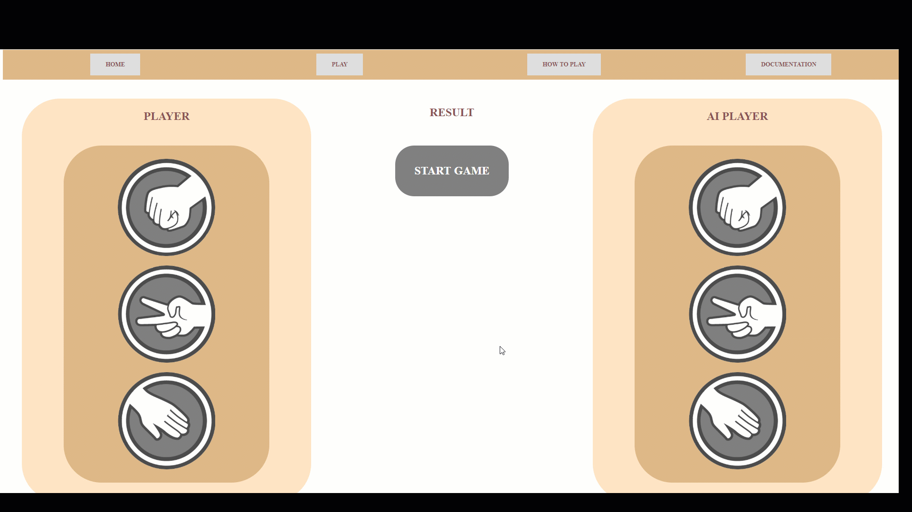

## Basic Overview

A Simple RSP game for Smartface interview.

 

## About Rock-Scissors-Paper
You can learn about Rock-Scissors-Paper game from link below:
<a href="https://en.wikipedia.org/wiki/Rock%E2%80%93paper%E2%80%93scissors">Wikipedia</a>
 

## Rules
The players usually count aloud to three, or speak the name of the game (e.g. "Rock! Paper! Scissors!" or "Ro Sham Bo!"), each time either raising one hand in a fist and swinging it down on the count or holding it behind. They then "throw" by extending it towards their opponent. Variations include a version where players use only three counts before throwing their gesture (thus throwing on the count of "Scissors!" or "Bo!"), or a version where they shake their hands three times before "throwing".

## How To Play
To start the game, simply click on the Start game button in the middle. After that, you will also need to select your very first shape.
Once the shape is selected the game starts automatically. Every 3 seconds a new shape is compared. Following the rules and conventions,
winner is selected and another game starts after 2 seconds of pause.

# Demo

#### Test Results

  AI Player Test Suite
    √ GetNextMove returns valid Move

  GameEngine Test Suite
    √ Game Starts and Stops correctly (4007ms)
    √ Game Starts and Stops and results aggregate returns non Null (6005ms)
    √ Player changes valid choice
    √ WINs , LOSEs or DRAWs for some time
    √ Player changes non-valid choice fails

  Server Test Suite
    √ Home Page should return 200OK (529ms)
    √ Play Page should return 200OK
    √ HowToPlay Page should return 200OK
    √ Documentation Page should return 200OK
    √ Unknown document(not the page) should get 500 Error
    √ Unknown Page should return 404-NotFound

  12 passing (11s)